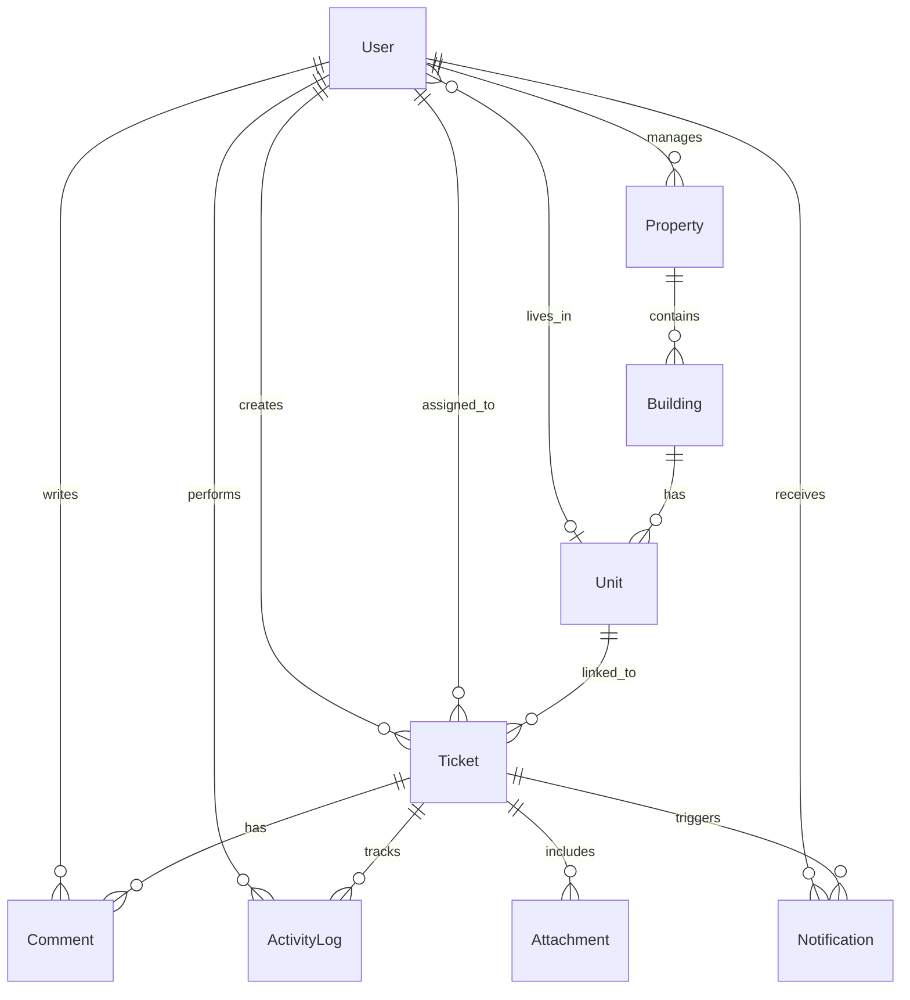

# PropMaint — Property Maintenance Management System

[](https://prop-maint.vercel.app)
[](#-docker-setup)
[](#-testing)
[](https://github.com/Puneethreddy2530/PropMaint/actions/workflows/ci.yml)

A mobile-first, zero-cost AI property maintenance platform built for the Qwego PropTech Challenge. Designed around real operational workflows across tenants, managers, and technicians.

## Quick Access

The demo is fully seeded with realistic workflows and a lived-in activity history.

| Role | Email | Password | What to Look For |
| :--- | :--- | :--- | :--- |
| Tenant | `sarah.johnson@demo.com` | `demo123` | Voice-to-text reporting, image uploads, real-time status tracking |
| Manager | `michael.chen@demo.com` | `demo123` | SLA monitoring, triage banner, bulk assignment |
| Technician | `james.rodriguez@demo.com` | `demo123` | Offline-first mode, task progress updates, resolution logs |

You can also use the 1-click Quick Login buttons on the login page.

## Demo Story Highlights

The seed data tells a story so the demo feels alive on first load:

- Emergency ticket actively breaching SLA (gas smell in Unit A-201)
- Routine ticket with a tenant/staff back-and-forth comment thread (AC issue in TH-1)
- Manager dashboard shows triage warnings and assigns multiple tickets at once

## How It Hits the Evaluation Criteria

### 1. Workflow Logic and Edge Cases
- Offline-first technician flow with a SyncManager queue for basement deadzones
- Strict SLA state machine with role-based enforcement on every transition
- Emergency detection for gas/fire/flood keywords with automatic escalation

### 2. No Paid APIs and Thoughtful UX
- Client-side AI triage via `transformers.js` in a Web Worker, zero API cost
- Fallback keyword matching if the model cannot load on a client
- Voice input using the native Web Speech API for mobile-first reporting

### 3. Backend Architecture and Data Integrity
- Next.js App Router + Server Actions with Zod validation
- Prisma schema designed around properties, buildings, units, and audit trails
- Immutable `ActivityLog` chain for every assignment, status change, and comment

### 4. Auth and Role Management
- Auth.js (NextAuth v5) with JWT sessions
- Granular RBAC: tenants cannot assign, technicians cannot delete, managers control triage

### 5. Tests and Quality
- Playwright E2E: tenant submits a ticket, manager assigns it
- Vitest unit tests for RBAC and core workflow utilities

## Core Features

- Role-based dashboards for tenants, managers, and technicians
- Multi-step ticket wizard with voice input, attachments, and auto-categorization
- SLA deadlines by priority with breach warnings and triage banners
- Bulk assignment for managers and visual “on fire” ticket indicators
- Activity timeline, notifications, and internal vs external comments
- Offline queue for technicians that syncs when connectivity returns

## Tech Stack

| Layer | Technology | Why |
| --- | --- | --- |
| Framework | Next.js 16.1 (App Router + Server Actions) | Single codebase, TypeScript end-to-end |
| Database | PostgreSQL (Neon in demo) | Serverless Postgres with free tier |
| ORM | Prisma | Type-safe schema and queries |
| Auth | NextAuth v5 (Auth.js) | JWT-based sessions and middleware protection |
| UI | shadcn/ui + Tailwind CSS | Accessible components and rapid iteration |
| AI | transformers.js | In-browser ML, zero API cost |
| Tests | Vitest + Playwright | Unit + E2E coverage |

## Database Schema



## Docker Setup

```bash
docker compose up --build
# DB is auto-seeded on startup (3 tenants, 2 managers, 5 technicians, 10 tickets)
# Open http://localhost:3000
```

## Local Development

```bash
# 1. Clone
git clone https://github.com/Puneethreddy2530/PropMaint.git
cd PropMaint

# 2. Install
npm install

# 3. Configure
cp .env.example .env
# Set DATABASE_URL, AUTH_SECRET, and RESEND_FROM_EMAIL if testing email

# 4. Database
npx prisma generate
npx prisma db push
npm run db:seed

# 5. Run
npm run dev
# Open http://localhost:3000
```

## Testing

```bash
# Unit tests (RBAC)
npm run test:unit

# E2E tests (Playwright)
# First time: npx playwright install
npm run test:e2e
```

## Email (Resend)

Set `RESEND_API_KEY` and `RESEND_FROM_EMAIL` in Vercel or your local `.env`, then use the Manager dashboard card to send a test email to yourself.

## Project Structure

```
src/
  actions/           # Server Actions (auth, tickets, activity logging)
  app/
    (auth)/login/    # Login with quick-demo role buttons
    (dashboard)/     # All protected pages
    api/             # Auth handler + file upload endpoint
  components/
    layout/          # App shell, theme toggle, offline banner, transitions
    tickets/         # Wizard, timeline, comments, upload, actions
    dashboard/       # Stat cards, recent tickets
    ui/              # shadcn/ui primitives
  lib/               # Auth, permissions, AI worker, speech, sync, utils
```

Built for the Qwego PropTech Challenge. No paid APIs. Fully demo-ready.
