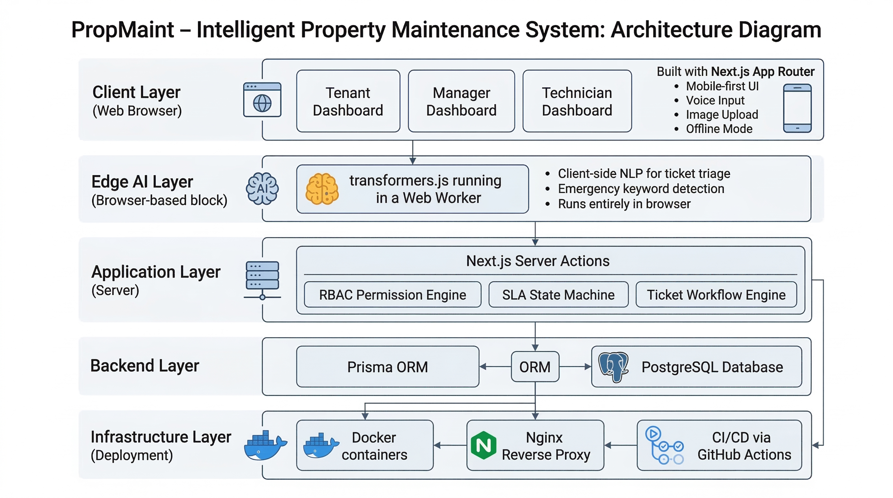
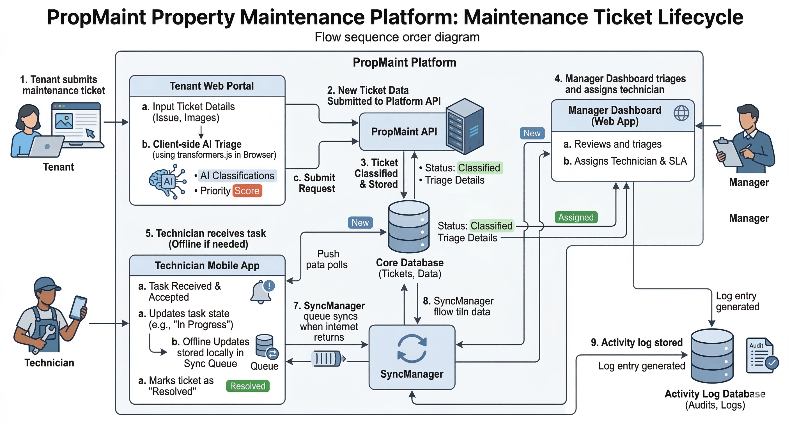

<div align="center">
  <h1>🏢 PropMaint</h1>
  <h3>Intelligent Property Maintenance Platform</h3>
  <p><i>Built for the <b>Qwego PropTech Full-Stack Challenge</b></i></p>

  [](https://prop-maint.vercel.app/login)
  [](#-docker--production)
  [](#-testing)
  [](https://github.com/Puneethreddy2530/PropMaint/actions/workflows/ci.yml)
</div>

<br />

A **mobile-first property maintenance platform** designed for real operational workflows across **tenants, property managers, and technicians**.

PropMaint combines **offline-first architecture**, **zero-cost edge AI**, and **strict SLA workflow enforcement** to solve the fragmented communication problems common in property management systems.

---

## 📑 Table of Contents

- [The Problem](#-the-problem)
- [Our Solution](#-our-solution)
- [Key Innovations](#-key-innovations)
  - [Edge AI Ticket Triage](#edge-ai-ticket-triage)
  - [Offline-First Technician Workflow](#-offline-first-technician-workflow)
  - [SLA Enforcement Engine](#-sla-enforcement-engine)
- [System Architecture](#-system-architecture)
- [Maintenance Ticket Lifecycle](#-maintenance-ticket-lifecycle)
- [Live Demo](#-live-demo)
- [Core Features](#-core-features)
- [Tech Stack](#-tech-stack)
- [Database Schema](#-database-schema)
- [Docker & Production](#-docker--production)
- [Local Development](#-local-development)
- [Testing](#-testing)
- [Challenge Submission & Impact](#-challenge-submission--impact)

---

## 🚨 The Problem

Property managers handle dozens of maintenance issues daily across multiple buildings and teams. Most current workflows rely on disconnected threads like **WhatsApp messages**, **Phone calls**, **Spreadsheets**, and **Email**.

This fragmented communication leads to:
❌ **Lost requests** and **delayed response times**
❌ **Poor accountability** with **no audit trail**
❌ **Technicians unable to work in offline environments** (basements, remote properties)

---

## 💡 Our Solution

PropMaint introduces a **structured, AI-assisted maintenance workflow platform**. It brings everything under one roof:
- **Tenants** report issues quickly with rich media and voice notes.
- **Managers** triage and assign tickets efficiently based on AI priority scoring.
- **Technicians** work seamlessly even in **offline environments**, auto-syncing when reconnected.

The system ensures **full traceability, SLA enforcement, and real-time workflow management**.

---

## 🧠 Key Innovations

### Edge AI Ticket Triage
PropMaint performs **Natural Language Processing directly in the browser** using `transformers.js + Web Workers`.
- **Zero API cost** (No OpenAI/Anthropic keys needed)
- **100% Privacy** (Data stays on the device during inference)
- **No UI blocking** (Runs in background thread)
- **Emergency detection** (e.g., Gas leaks, Fire hazards, Flooding)

*If the ML model fails to load, a resilient fallback keyword detection system takes over.*

### ⚡ Offline-First Technician Workflow
Technicians frequently work in basements, underground parking, or remote areas with poor signal. PropMaint includes a **SyncManager queue system** that allows technicians to:
- Update ticket progress
- Upload notes
- Log work

*All while completely offline.* When connectivity returns, the queue automatically **syncs with the server**.

### 🔥 SLA Enforcement Engine
Every ticket in PropMaint is governed by a **priority-based SLA state machine**.
Features include: deadline tracking, automatic breach detection, visual "on fire" indicators, and manager escalation banners. **Critical maintenance issues cannot be ignored.**

---

## 🏗️ System Architecture

PropMaint follows a **modern full-stack architecture** built for scalability, utilizing React Server Components and Server Actions in Next.js.



AI processing occurs **directly on the client device** using Web Workers, while robust PostgreSQL databases handle state management and data integrity. Deployment is handled seamlessly via **Docker + Nginx Reverse Proxy**.

---

## 🔄 Maintenance Ticket Lifecycle

The flow of a ticket from inception by a tenant to resolution by a technician is orchestrated to be perfectly smooth, enforcing accountability at every step.



1. **Submit**: Tenant creates a ticket (Edge AI parses it).
2. **Triage**: Manager reviews AI classification and assigns a technician.
3. **Execute**: Technician receives task, travels to site, and completes it (offline-ready).
4. **Log**: Every action is immutably stored in the Activity DB.

---

## 🎯 Live Demo

The demo environment is pre-seeded with realistic data to evaluate the system instantly.

| Role | Email | Password |
|-----|------|------|
| Tenant | `sarah.johnson@demo.com` | `demo123` |
| Manager | `michael.chen@demo.com` | `demo123` |
| Technician | `james.rodriguez@demo.com` | `demo123` |

**Demo Story:** The seeded database includes an *emergency gas leak ticket currently breaching SLA*, a *tenant-technician conversation thread*, and multiple tickets ready for *bulk assignment by managers*. This allows judges to immediately experience the full workflow.

---

## 🚀 Core Features

### Role-Based Workflow
PropMaint separates permissions explicitly:
- **Tenants:** Report issues (voice-to-text, images), track progress.
- **Managers:** Triage requests, assign technicians, monitor SLA breaches.
- **Technicians:** Update task progress, work offline, log resolution details.

### Multi-Step Ticket Wizard
Submitting a ticket is intuitive for non-technical users, employing voice-to-text input, image attachments, and automatic AI categorization.

### Immutable Activity Logs
Every ticket action is permanently recorded (status changes, assignments, comments). This creates a **complete, indisputable audit trail.**

### Modern UX
- **Dark / Light theme toggle**
- **Mobile-first, responsive interface**
- **Offline network banners**
- **Real-time notifications & Activity timeline**

---

## 🛠️ Tech Stack

| Layer | Technology |
|-----|-----|
| **Framework** | Next.js 16 (App Router + Server Actions) |
| **Database** | PostgreSQL |
| **ORM** | Prisma |
| **Authentication** | NextAuth v5 (Auth.js) |
| **Styling** | Tailwind CSS + shadcn/ui |
| **Edge AI** | transformers.js |
| **Testing** | Playwright + Vitest |
| **Deployment** | Docker + Nginx |

---

## 🗄️ Database Schema

A robust, normalized relational database handles users, properties, tickets, and granular audit logging.


*(The schema defines strict foreign key relationships ensuring data integrity across Properties, Buildings, Units, and the Users who interact with them.)*

---

## 🐳 Docker & Production

PropMaint includes a **production-ready container setup**. To launch a full production replica locally:

```bash
docker compose up --build
```

The system automatically builds containers, initializes the database, and seeds the demo data. Access the app at `http://localhost:3000`.

---

## 💻 Local Development

1. **Clone the repository**
```bash
git clone https://github.com/Puneethreddy2530/PropMaint.git
cd PropMaint
```

2. **Install dependencies**
```bash
npm install
```

3. **Configure environment variables**
```bash
cp .env.example .env
```
*(Fill in the standard Postgres credentials if not using Docker)*

4. **Initialize the database**
```bash
npx prisma generate
npx prisma db push
npm run db:seed
```

5. **Start the development server**
```bash
npm run dev
```

---

## 🧪 Testing

The platform leverages robust automated testing to ensure reliability.

**Unit tests:**
```bash
npm run test:unit
```

**End-to-end (E2E) tests:**
```bash
npx playwright install
npm run test:e2e
```
*CI pipelines automatically run these tests on every push via GitHub Actions.*

---

## 🏁 Challenge Submission & Impact

PropMaint was explicitly designed and built for the **Qwego PropTech Full-Stack Challenge**.

The system demonstrates:
- **Deep domain understanding:** Real-world workflow modeling that directly maps to how property managers actually work.
- **Resilience:** Offline capabilities addressing the #1 complaint of maintenance technicians (poor cellular coverage in basements).
- **Cost-Effective Scalability:** Zero-cost AI integration that triage's support tickets instantly without exorbitant API bills.
- **Production-grade engineering:** Strict schemas, E2E tests, and Dockerized deployment.

> *This isnn't just build a CRUD app; I built a system that fundamentally improves the operational efficiency of property management.*
