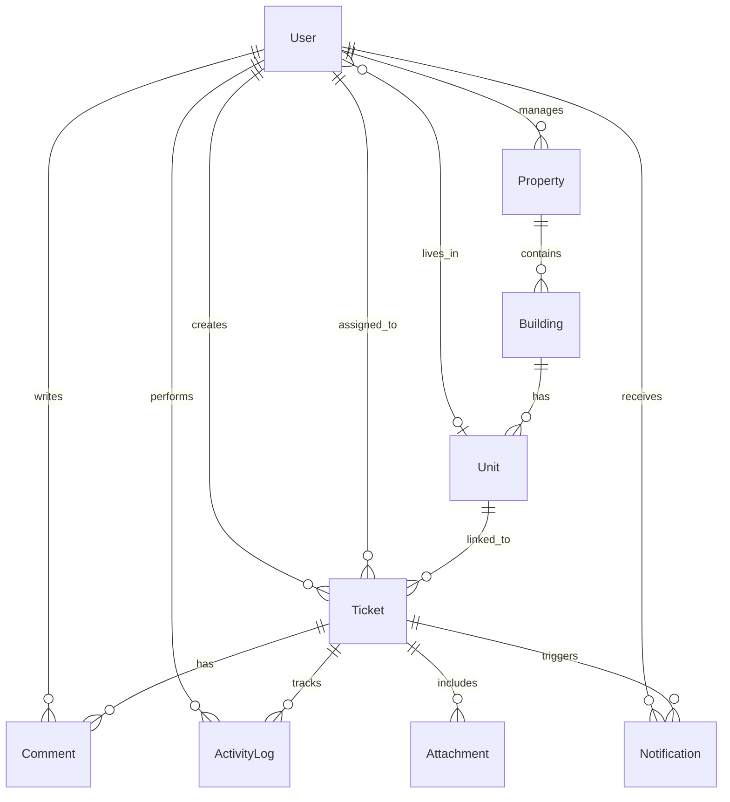

# PropMaint — Intelligent Property Maintenance Platform

[](https://prop-maint.vercel.app)
[](#docker--production)
[](#testing)
[](https://github.com/Puneethreddy2530/PropMaint/actions/workflows/ci.yml)

A **mobile-first property maintenance platform** designed for real operational workflows across **tenants, property managers, and technicians**.

PropMaint combines **offline-first architecture**, **zero-cost edge AI**, and **strict SLA workflow enforcement** to solve the fragmented communication problems common in property management systems.

Built for the **Qwego PropTech Challenge**.

---

# 🏢 The Problem

Property managers handle dozens of maintenance issues daily across multiple buildings and teams.

Most current workflows rely on:

• WhatsApp messages  
• Phone calls  
• Spreadsheets  
• Email threads  

This leads to:

❌ lost requests  
❌ delayed response times  
❌ poor accountability  
❌ no audit trail  
❌ technicians unable to work in offline environments  

---

# 💡 Our Solution

PropMaint introduces a **structured, AI-assisted maintenance workflow platform** that enables:

• Tenants to report issues quickly  
• Managers to triage and assign tickets efficiently  
• Technicians to work even in **offline environments**

The system ensures **full traceability, SLA enforcement, and real-time workflow management**.

---

# 🧠 Key Innovations

## Edge AI Ticket Triage

PropMaint performs **Natural Language Processing directly in the browser** using:

```
transformers.js + Web Workers
```

This enables:

• **zero API cost**
• **no external dependencies**
• **no UI blocking**

The AI automatically classifies maintenance requests and detects **emergency issues such as:**

- Gas leaks
- Fire hazards
- Flooding

If the ML model fails to load, a **fallback keyword detection system** ensures reliability.

---

## ⚡ Offline-First Technician Workflow

Technicians frequently work in:

- basements
- underground parking
- areas with poor signal

PropMaint includes a **SyncManager queue system** that allows technicians to:

• update ticket progress  
• upload notes  
• log work  

even while offline.

When connectivity returns, the queue automatically **syncs with the server**.

---

## 🔥 SLA Enforcement Engine

Every ticket in PropMaint is governed by a **priority-based SLA state machine**.

Features include:

• deadline tracking  
• automatic breach detection  
• visual "on fire" indicators  
• manager escalation banners  

This ensures **critical maintenance issues cannot be ignored.**

---

# 🎯 Live Demo

The demo environment is pre-seeded with realistic data.

| Role | Email | Password |
|-----|------|------|
| Tenant | `sarah.johnson@demo.com` | `demo123` |
| Manager | `michael.chen@demo.com` | `demo123` |
| Technician | `james.rodriguez@demo.com` | `demo123` |

### Demo Story

The seeded database includes:

• An **emergency gas leak ticket currently breaching SLA**  
• A **tenant-technician conversation thread**  
• Multiple tickets ready for **bulk assignment by managers**

This allows judges to immediately experience the full workflow.

---

# 🏗️ System Architecture

PropMaint follows a **modern full-stack architecture** built for scalability.

```
Client (Next.js App Router)
        │
        │ Server Actions
        ▼
Application Layer
        │
        ▼
Prisma ORM
        │
        ▼
PostgreSQL Database
```

AI processing occurs **directly on the client device** using Web Workers.

Deployment is handled via:

```
Docker + Nginx Reverse Proxy
```

---

# 🚀 Core Features

### Role-Based Workflow

PropMaint separates permissions for:

**Tenants**

- report issues
- upload images
- track progress

**Managers**

- triage requests
- assign technicians
- monitor SLA breaches

**Technicians**

- update task progress
- work offline
- log resolution details

---

### Multi-Step Ticket Wizard

Tenants submit issues through a guided workflow including:

• voice-to-text input  
• image attachments  
• automatic categorization  

---

### Immutable Activity Logs

Every ticket action is permanently recorded.

Examples include:

• status changes  
• technician assignments  
• comments  
• updates  

This creates a **complete audit trail.**

---

### Modern UX

PropMaint includes several usability improvements:

• Dark / Light theme toggle  
• Mobile-first interface  
• Offline network banners  
• Real-time notifications  
• Activity timeline

---

# 🛠️ Tech Stack

| Layer | Technology |
|-----|-----|
| Framework | Next.js 16 (App Router + Server Actions) |
| Database | PostgreSQL |
| ORM | Prisma |
| Authentication | NextAuth v5 (Auth.js) |
| Styling | Tailwind CSS + shadcn/ui |
| AI | transformers.js |
| Testing | Playwright + Vitest |
| Deployment | Docker + Nginx |

---

# 🗄️ Database Schema



---

# 🐳 Docker & Production

PropMaint includes a **production-ready container setup**.

```
docker compose up --build
```

The system automatically:

• builds containers  
• initializes the database  
• seeds demo data  

Access the app:

```
http://localhost:3000
```

---

# 💻 Local Development

Clone the repository

```
git clone https://github.com/Puneethreddy2530/PropMaint.git
cd PropMaint
```

Install dependencies

```
npm install
```

Configure environment variables

```
cp .env.example .env
```

Initialize the database

```
npx prisma generate
npx prisma db push
npm run db:seed
```

Start the development server

```
npm run dev
```

---

# 🧪 Testing

Unit tests

```
npm run test:unit
```

End-to-end tests

```
npx playwright install
npm run test:e2e
```

CI pipelines automatically run these tests on every push.

---

# 📂 Project Structure

```
.github/workflows/   CI/CD pipelines
prisma/              Database schema
scripts/             Database seeding
src/
 ├ actions/          Server actions
 ├ app/              App router pages
 ├ components/       UI components
 │   ├ layout
 │   ├ dashboard
 │   ├ tickets
 │   └ ui
 └ lib/              AI worker, speech, sync utilities
tests/               Unit + E2E tests

docker-compose.yml
nginx.conf
Dockerfile
```

---

# 🏁 Challenge Submission

PropMaint was built for the **Qwego PropTech Full-Stack Challenge**.

The system demonstrates:

• real-world workflow modeling  
• scalable architecture  
• offline resilience  
• zero-cost AI integration  
• production-grade deployment

No paid APIs were used.

---