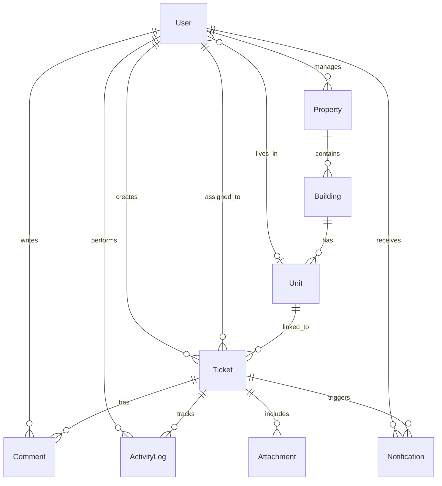

# 🏢 PropMaint — Property Maintenance Management System

> **Mobile-first, AI-powered property maintenance platform** built for the Qwego PropTech Challenge.

[](https://github.com/Puneethreddy2530/PropMaint/actions/workflows/ci.yml)
[](https://prop-maint.vercel.app)

---

## Demo Accounts

Use the **Quick Demo Access** buttons on the login page, or sign in manually:

| Role | Email | Password | Capabilities |
|------|-------|----------|-------------|
| 🏠 Tenant | sarah.johnson@demo.com | demo123 | Submit requests (voice + photo), track status, verify repairs |
| 👔 Manager | michael.chen@demo.com | demo123 | View all tickets, assign technicians, analytics, SLA monitoring |
| 🔧 Technician | james.rodriguez@demo.com | demo123 | View assignments, update progress, add resolution notes |

---

## What Makes This Different

This isn't a generic CRUD ticketing app. Every feature was designed around how property maintenance **actually works**.

### Core Platform
- **Role-Based Access Control** — 14 granular permissions across 3 roles, enforced on every server action
- **Smart Ticket Wizard** — Multi-step form with category selection, emergency keyword detection (gas/fire/flood triggers safety instructions + auto-escalation), permission-to-enter, preferred times
- **Status State Machine** — Open → Assigned → In Progress → On Hold → Completed → Verified → Closed with role-enforced transitions
- **SLA Engine** — Auto-calculated deadlines per priority (Emergency: 2h, Urgent: 24h, Routine: 72h) with breach detection and visual warnings
- **Activity Timeline** — Cryptographic audit trail: every mutation is logged with a chained SHA-256 hash preventing database tampering
- **File Uploads** — Drag & drop image attachments with type/size validation and gallery view
- **In-App Notifications** — Smart routing: tenants get status updates, staff get assignments, managers get escalations
- **Comments** — External (tenant-visible) + internal staff-only notes

### Beyond the Brief
- **Client-Side AI Triage** — Zero-shot classification via `transformers.js` running in a Web Worker. Auto-categorizes issues from text description. Zero API cost. Fully private.
- **Voice-to-Text** — Speech Recognition API for hands-free ticket submission on mobile
- **Offline-First Mode** — Network detection + SyncManager queue for technicians working in basements/elevators
- **Dark/Light Theme** — System-aware with manual toggle via `next-themes`
- **Page Transitions** — Framer Motion animations between routes
- **PWA Ready** — Web app manifest for home screen installation
- **Analytics Dashboard** — SLA compliance rate, avg resolution time, tickets by status/priority/category

---

## Architecture

```
┌──────────────────────────────────────────────────────────┐
│                    Client (PWA)                            │
│  Mobile: Bottom Tab Nav  │  Desktop: Sidebar              │
│  AI Triage (Web Worker)  │  Voice Input  │  Offline Queue │
└────────────────────┬─────────────────────────────────────┘
                     │ Server Actions + API Routes
┌────────────────────▼─────────────────────────────────────┐
│               Next.js 15 (App Router)                     │
│  NextAuth v5 (JWT + RBAC)  │  Zod Validation              │
│  SHA-256 Audit Chain       │  SLA Engine   │  Sonner Toast │
└────────────────────┬─────────────────────────────────────┘
                     │ Prisma ORM
┌────────────────────▼─────────────────────────────────────┐
│            PostgreSQL (Neon — serverless)                  │
│  13 Models  │  6 Enums  │  Optimized Indexes              │
└──────────────────────────────────────────────────────────┘
```

## Tech Stack

| Layer | Technology | Why |
|-------|-----------|-----|
| Framework | **Next.js 15** (App Router + Server Actions) | Single codebase, TypeScript end-to-end, no CORS |
| Database | **PostgreSQL** via **Neon** | Free serverless Postgres, Vercel-native |
| ORM | **Prisma** | Schema-first, type-safe queries, auto-migrations |
| Auth | **NextAuth.js v5** | JWT, middleware route protection, RBAC callbacks |
| UI | **shadcn/ui + Tailwind CSS** | Radix accessibility, full ownership, dark mode |
| AI | **transformers.js** | In-browser ML, zero API cost, privacy-first |
| Validation | **Zod** | Runtime type checking on all mutations |
| Deployment | **Vercel** + **Docker** | Zero-config hosting + containerized alternative |

## Database Schema



---

## Getting Started

### Option A: Local Development

```bash
# 1. Clone
git clone https://github.com/Puneethreddy2530/PropMaint.git
cd PropMaint

# 2. Install
npm install

# 3. Configure
cp .env.example .env
# Edit .env with your Neon connection string
# Generate AUTH_SECRET: openssl rand -base64 32

# 4. Database
npx prisma generate
npx prisma db push
npm run db:seed

# 5. Run
npm run dev
# Open http://localhost:3000
```

### Option B: Docker

```bash
docker compose up --build
# DB is auto-seeded on startup (3 tenants, 2 managers, 5 technicians, 10 tickets)
# Open http://localhost:3000
```

### Testing

```bash
# Unit tests (RBAC)
npm run test:unit

# E2E tests (Playwright)
# First time: npx playwright install
npm run test:e2e
```

---

## Project Structure

```
src/
├── actions/           # Server Actions (auth, tickets, activity logging)
├── app/
│   ├── (auth)/login/  # Login with quick-demo role buttons
│   ├── (dashboard)/   # All protected pages (10 routes)
│   └── api/           # Auth handler + file upload endpoint
├── components/
│   ├── layout/        # AppShell, theme toggle, offline banner, transitions
│   ├── tickets/       # Wizard, timeline, comments, upload, actions
│   ├── dashboard/     # Stat cards, recent tickets
│   └── ui/            # shadcn/ui primitives
└── lib/               # Auth, permissions, AI worker, speech, sync, utils
```

## Design Decisions

1. **Server Actions over API Routes** — Type-safe, no client fetch boilerplate, progressive enhancement
2. **JWT over Session DB** — No Redis needed, works in Vercel serverless, role in token for zero-latency auth
3. **Chained SHA-256 Audit** — Each activity log hashes the previous entry's hash, creating a tamper-evident chain
4. **Client-Side ML** — `transformers.js` in a Web Worker avoids blocking the UI thread and costs $0
5. **SLA as First-Class** — Deadlines auto-calculated from priority, checked on every status mutation
6. **Offline Queue** — localStorage-based mutation queue with automatic sync on reconnect

---

*Built for the Qwego PropTech Full-Stack Challenge · No paid APIs · All demo data*
